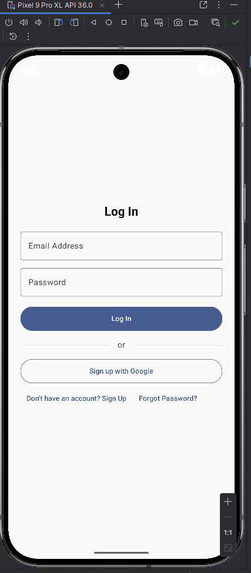

# 📲 College Alert Application

### ✅ Task 1: CodeAlpha Internship – July Batch

A beginner-friendly Android application that sends **notifications about campus events** to students and helps them stay informed.

---

## 🎯 Objective

To develop a mobile app that:
- Notifies students about important **college events**
- Displays event data stored in **Firebase Realtime Database**
- Allows authenticated users (students/admin) to access relevant features
- Enables admins to upload new data directly from the app

---

## 📌 Purpose

This app helps students stay **updated** and **organized** by receiving alerts and viewing content related to:

- 🎓 Seminars  
- 📚 Courses  
- 👥 Panels  
- 📝 Examinations  
- 📢 Other Notifications  

---

## 🧩 Features

### 👋 Welcome Screen
- Introductory screen shown on app launch

### 🔐 Login / Signup
- Login with email and password
- Signup stores user data in **Firebase Firestore**

### 🏠 Home Screen
- Displays latest event data from **Firebase Realtime Database**
- Categorized neatly as:
  - Seminars
  - Courses
  - Panels
  - Examinations
  - Other Notifications

### 🚨 Alert Screen
- Receives and shows real-time **push notifications** using **Firebase Cloud Messaging (FCM)**

### 🧑‍💼 Admin Panel
- Admins can:
  - Post event data to Firebase
  - Choose category for each post (Seminar, Courses, etc.)

### 👤 Profile Screen
- Shows current user details fetched from **Firebase Firestore**

---

## 📂 Screenshots

| Welcome | Login | Signup |
|--------|--------|--------|
|  |  |  |

| Home | Alerts | Admin Panel | Profile |
|------|--------|--------------|---------|
|  |  |  |  |

---

## 🛠 Tech Stack

- **Language:** Kotlin  
- **UI Framework:** Jetpack Compose  
- **IDE:** Android Studio  

### 🔙 Backend:
- **Firebase Authentication** – User login/signup
- **Firebase Firestore** – Stores user profile data
- **Firebase Realtime Database** – Stores all event/category data
- **Firebase Cloud Messaging (FCM)** – Sends push notifications

---

## ⚙️ How to Run

1. Clone the repository:
   ```bash
   git clone https://github.com/deepak-kb/codealpha_tasks.git

⚠️ Important: Firebase Configuration
For security reasons, the google-services.json file has NOT been uploaded to this repository.
This file is required to use Firebase features such as Authentication, Firestore, Realtime Database, and Cloud Messaging.

To run the app:

1. Create your own Firebase project at Firebase Console.
2. Register your Android app’s package name in your Firebase project.
3. Download your personal google-services.json file from Firebase Console.
4. Place the google-services.json file in the app/ directory of your project.
